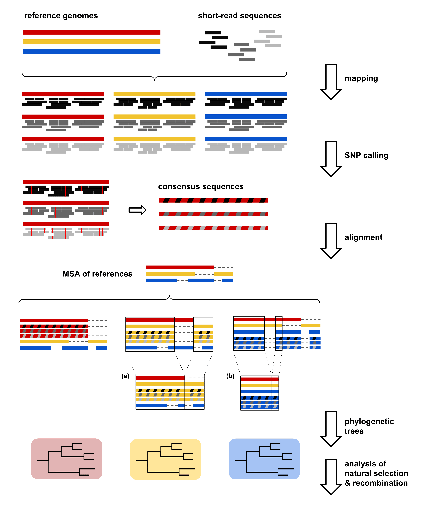

# Evaluation of the effect of reference choice on mapping
Pipeline for the evaluation of the effect of reference choice on short-read mapping as performed in the work *One is not enough: on the effects of reference genome for the mapping and subsequent analyses of short-reads. BioRxiv [Preprint]. 2020*. Available from: [https://doi.org/10.1101/2020.04.14.041004](https://www.biorxiv.org/content/10.1101/2020.04.14.041004v1).

The workflow is summarized in Fig 1:


## Dependencies

The main script (`refeval_main.sh`) depends on different external dependencies. All required programs should be in $PATH. The required scripts, "codeml.ctl" file, and folders "ffn" and "gff" containing annotation files should be placed in the same directory where `refeval_main.sh` is executed.

### Required software
* bwa
* samtools
* bcftools
* progressiveMauve
* IQ-tree
* TreeCmp
* Proteinortho
* extractseq (EMBOSS package)
* codeml (PAML package)
* LDJump
* LDhat
* Phi (PhiPack)

### Required scripts
Python and R scripts are available at https://github.com/cvmullor/reference
'xmfa2fasta.pl' is available at https://github.com/kjolley/seq_scripts
  
* change_cns_header.py
* xmfa_complement.py
* gaps_xmfa.py
* mask_msa.py
* cds_revcomp.py
* rho_LDJump.R
* plots.R
* stats.R
* xmfa2fasta.pl

### Required Python libraries
* Biopython

### Required R libraries
* ggplot2
* dplyr

### Required files
* Prokka annotation (FFN) of reference sequences
* Prokka annotation (GFF) of reference sequences
* codeml.ctl

## Usage

### Quick run

`refeval_main.sh` runs all the steps performed in the work (mapping, variant calling and filtering, consensus sequence, mapping statistics, alignment, tree inference and comparison, compute dN/dS, compute recombination rates, plotting and performing statistical tests) by providing the path to a directory containing >=1 reference sequences (FASTA) and to paired-end reads (FASTQ).

`./refeval_main.sh -r references/ -s reads/`

### Quality control

To filter and trim low-quality reads, a FASTA file containing adapters to be removed should be supplied.

`./refeval_main.sh -r references/ -s reads/ -q adapters.fasta`

## Options

### `-h` (help)
```
Usage: ./refeval_main.sh [-hd] -r <path/to/references> -s <path/to/reads> [-t threads] [-q adapters_file]
Options:
 -r       path to the folder that contains the reference sequences (FASTA) for mapping
 -s       path to the folder that contains the reads (FASTQ) to be mapped
 -t       number of threads to be used during mapping
 -q       path to file with adapters to be removed during read quality
          processing. If no file is provided, QC step will not be performed
 -h       this help message
 -d       required dependencies and files
```

### `-d` (required dependencies and files)
```
Required software:
        bwa
        samtools
        bcftools
        progressiveMauve
        IQ-tree
        TreeCmp
        Proteinortho
        extractseq (EMBOSS package)
        codeml (PAML package)
        LDJump
        LDhat
        Phi (PhiPack)

Required scripts:
        change_cns_header.py
        xmfa_complement.py
        gaps_xmfa.py
        mask_msa.py
        cds_revcomp.py
        rho_LDJump.R
        plots.R
        stats.R
        xmfa2fasta.pl

  Python and R scripts are available at https://github.com/cvmullor/reference
  'xmfa2fasta.pl' is available at https://github.com/kjolley/seq_scripts

Required python libraries:
        Biopython

Required R libraries:
        ggplot2
        dplyr

Required files:
        Prokka annotation (FFN) of reference sequences
        Prokka annotation (GFF) of reference sequences
        codeml.ctl
```

All required programs should be in $PATH. The required scripts, as well as folders "ffn" and "gff" containing annotation files and "codeml.ctl", should be placed in the same folder where `refeval_main.sh` is executed. 


### `-r` (references)
Path to the folder containing the reference sequences (in fasta/fna format) that will be used for read mapping.

### `-s` (samples)
Path to the folder containing the reads (in fastq format) that will be mapped against the different references.

### `-t` (threads) [optional]
Number of threads that BWA MEM will use for mapping step. Default: 1

### `-q` (quality control) [optional]
Path to the file containing the adapters to be removed during read quality processing. Quality trimming and filtering will also be performed.
If no file is provided, QC step will be skipped.

## Description of scripts

Usage is detailed in the header section of each script.

`refeval_main.sh`: main script. Performs the main steps decribed in the work:
  1) If specified, low-quality reads are filtered and trimmed.
  2) Map each sample to each reference, call and filter variants, and obtain a consensus sequence from each mapping.
  3) Compute mapping statistics.
  4) Align consensus and reference sequences and mask the final MSAs.
  5) Infer phylogenetic trees from each MSA and evaluate topological similarity with congruence tests and tree distances.
  6) Extract and concate CDSs to compute paiwise dN/dS values between consensus sequences obtained from mappings to the same reference.
  7) Compute recombination rates along the MSAs.
  8) Make plots of each parameter studied.
  9) Get summary statistics of each parameter and test for significant differences depending on reference choice.

`change_cns_header.py`: change consensus sequence headers to include sample name and reference strain.

`xmfa_complement.py`: complement a XMFA-formatted MSA of reference sequences with consensus sequences associated with one of these references.

`gaps_xmfa.py`: add gaps to regions of a XMFA-formatted MSA where homologous sequences are absent in any genome. 

`mask_msa.py`: remove columns with gaps in the sequence(s) specified by the user.

`cds_revcomp.py`: make reverse complement sequence from a CDS if necessary.

`rho_LDJump.R`: compute population recombination rates (rho values) along a MSA in 1000pb windows.

`plots.R`: make boxplots of number of SNPs, percentage of reference covered by reads, mean coverage and pairwise dN/dS values, and the distribution of rho along the MSAs.

`stats.R`: get summary statistics of all the parameters. Perform Kruskal-Wallis and Wilcoxon tests (for mapping statsitics and dN/dS), and pairwise Kolmogorov-Smirnov tests (for rho distributions)

